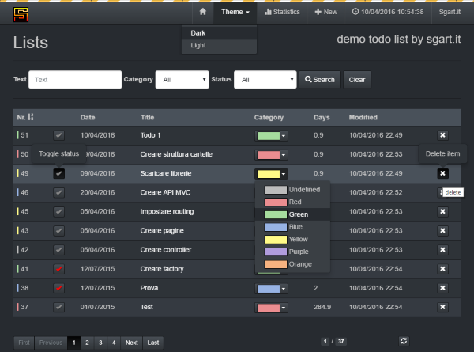

# python_angular1_todo
esempio di todo list in python 3 e angular 1

vedi https://www.sgart.it/IT/informatica/todo-list-in-angularjs-e-nodejs/post

per creare il DB MS SQL Server: /sql-scripts/mssql.sql

le password di accesso sono in: /configs.json

per installare i pacchetti mancanti: pip install -r requirements.txt

per eseguirlo: start.bat

il sito risponde all'indirizzo: http://127.0.0.1:5000

# note
per debug e auto reload in app.py
if __name__ == "__main__":
  app.run(debug = True)

# driver sql server 
https://docs.microsoft.com/it-it/sql/connect/python/pyodbc/step-3-proof-of-concept-connecting-to-sql-using-pyodbc?view=sql-server-2017